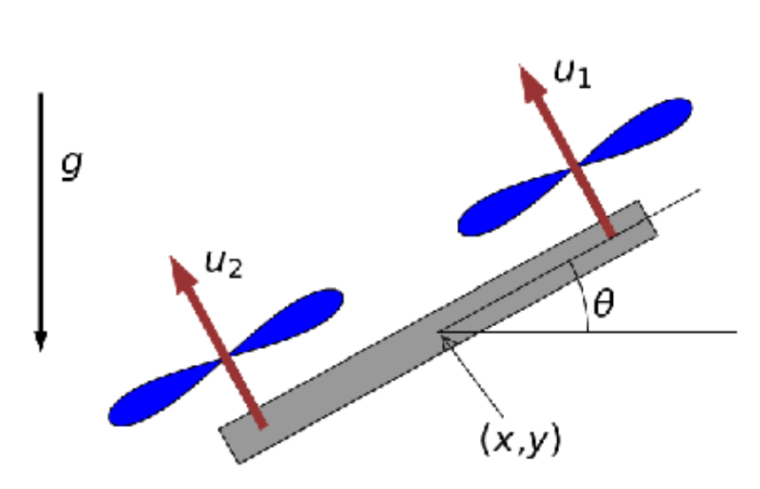

# Quadrotor Control with Iterative LQR

This project implements various control strategies for a 2D quadrotor, culminating in an acrobatic flip maneuver using iterative Linear Quadratic Regulator (iLQR). Developed as part of the Reinforcement Learning and Optimal Control course at NYU Computer Engineering under [Prof. Ludovic Righetti](https://engineering.nyu.edu/faculty/ludovic-righetti).

## Project Overview

The project explores increasingly sophisticated control strategies for a 2D quadrotor system:

### System Dynamics

The quadrotor is modeled as a 6-dimensional system with state vector z = [x, vx, y, vy, θ, ω]ᵀ where:
- (x, y): Position coordinates
- (vx, vy): Linear velocities
- θ: Orientation angle
- ω: Angular velocity

Control inputs u = [u₁, u₂]ᵀ represent the forces produced by the two rotors.

### Mathematical Foundation

The system dynamics are governed by the following equations:

$$\begin{align} 
\dot{x} &= v_x\\
m \dot{v}_x &= - (u_1 + u_2) \sin \theta \\ 
\dot{y} &= v_y\\
m \dot{v}_y &= (u_1 + u_2) \cos \theta  - m g\\
\dot{\theta} &= \omega\\
I \dot{\omega} &= r (u_1 - u_2)
\end{align}$$

where:
- m is the quadrotor mass
- I is the moment of inertia (scalar)
- r is the distance from center to propellers
- g is the gravity constant
- u₁, u₂ are the rotor forces (control inputs)



### Implementation Progression

1. **Basic Stabilization**
   - Computed optimal rotor forces (u₁*, u₂*) for hovering
   - Implemented basic position maintenance

2. **Disturbance Rejection**
   - Developed LQR controller for stabilization
   - Handles external disturbances (e.g., wind forces)
   - Uses state feedback for robust position control

3. **Trajectory Following**
   - Extended control for dynamic trajectory tracking
   - Implemented continuous path following capabilities

4. **Acrobatic Maneuver**
   - Implemented iLQR for complex nonlinear control
   - Achieved full 360° flip maneuver
   - Handles large state deviations and nonlinear dynamics

## Technical Implementation

### Key Components
- `quadrotor.py`: Core dynamics simulation and visualization
- `solver.py`: LQR and iLQR implementation using JAX
- Jupyter notebooks for each implementation phase

### Technologies Used
- Python for core implementation
- JAX for automatic differentiation and optimization
- Matplotlib for visualization and animation

## Getting Started

### Prerequisites
- Python 3.x
- Jupyter Notebook
- Required packages: numpy, matplotlib, JAX, IPython

### Running the Project
1. Clone the repository
2. Install dependencies:
   ```bash
   pip install -r requirements.txt
   ```
3. Run the Jupyter notebooks in sequence (Part 1-4)

## Implementation Details

The project uses JAX for efficient computation of gradients and optimization. Key features:
- Automatic differentiation for system dynamics
- Iterative optimization for nonlinear control
- Real-time visualization of quadrotor behavior

## Results and Visualization

The project includes visualization tools to demonstrate:
- Hovering stability
- Disturbance response
- Trajectory tracking
- Flip maneuver execution

Each control strategy can be visualized through the `animate_robot` function in `quadrotor.py`.
