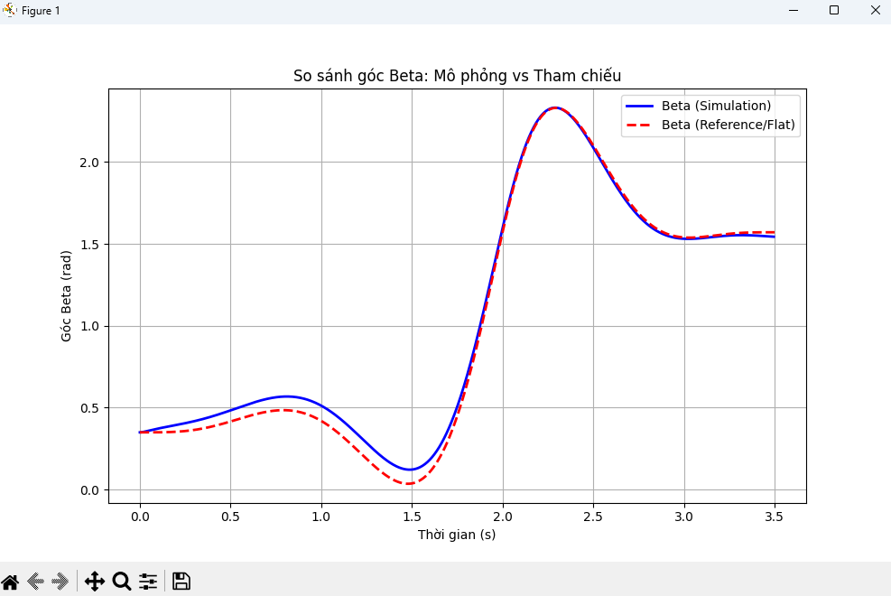

# Weekly Report

**Prepared by:** Huy Quang Nguyen    

**Date:** 21/11/2025

---

# Last week

- Tìm hiểu cơ bản về QP và Lagrange
- Code 

---
# Task in progess

- Viết quyển đồ án
- Đọc sách về math và robotics
- Kết nối trajactory plan với control => mô phỏng

---
# Viết quyển
Dự kiến
- Chương 1 : Tổng quan về quadrotor
- Chương 2 : Động lực học của hệ
- Chương 3 : Quadratic programming

---
# Đọc sách 
Convex Optimazition 
-  Chương 1,2 : lý thuyết

---
# Code
- Beta compare

---
# Code
<h3>Video mô phỏng</h3>

<video src="video11.mp4" width="700" controls>
  Trình duyệt không hỗ trợ video.
</video