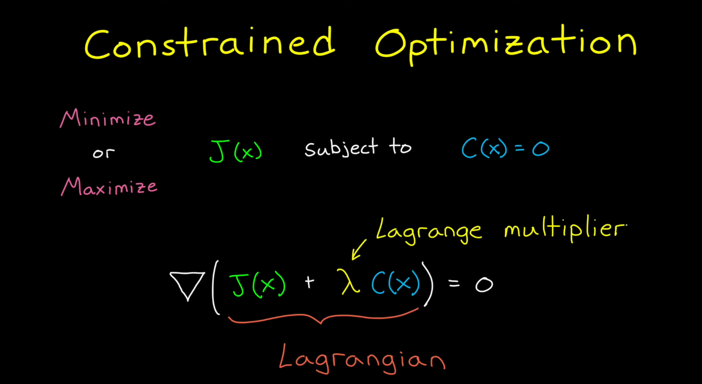
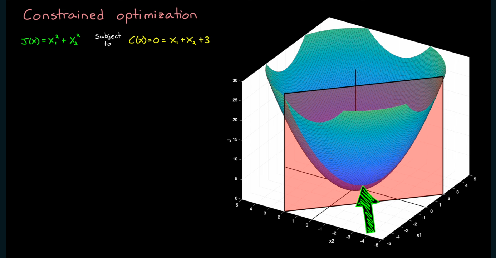
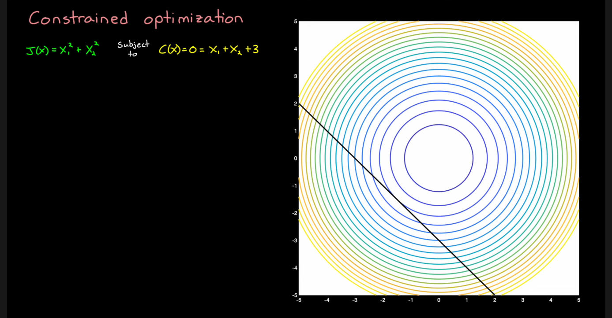
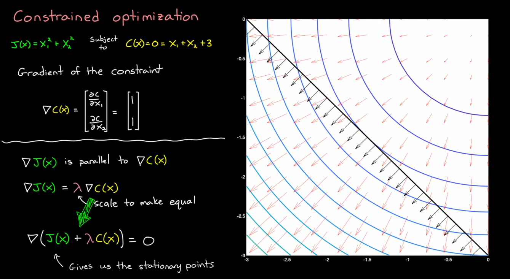

# Weekly Report

**Prepared by:** Huy Quang Nguyen    

**Date:** 24/10/2025

---
## Accomplishments

- **Completed Tasks:**  
    - Mô phỏng quadrotor bay từ A tới B 
    - Xây dựng QP
---

## Tasks in Progress

- Tìm hiểu kĩ hơn về QP
- Sửa lại mô phỏng quad, cấu trúc code 

---

# Lagrange multiplier
---

- Source : [Constrained Optimization](https://youtu.be/GR4ff0dTLTw?si=p1bhfFilPfeA5Dzh)

---

## **Tối ưu có ràng buộc**

- **Hàm mục tiêu:** $J(x_1, x_2) = x_1^2 + x_2^2$ 
- **Hàm ràng buộc:** $C(x_1, x_2) = x_1 + x_2 + 3 = 0$ 

- Source : [Constrained Optimization](https://youtu.be/GR4ff0dTLTw?si=p1bhfFilPfeA5Dzh)

---

---

---

# Convex Optimization
- Source : [Visually Explained](https://youtu.be/uh1Dk68cfWs?si=DU9xcbKCmsRUOxf0)

---

## What is Optimization?

Tối ưu hóa là quá trình **tìm kiếm phương án tốt nhất** nhằm mục đích:
* **Tối thiểu hóa (Minimize):** Chi phí, rủi ro, thời gian, sai số.
* **Tối đa hóa (Maximize):** Lợi nhuận, hiệu suất, độ bền.

---

## Components

1.  **Biến quyết định (Decision Variables) $x$**
    * Là những thứ bạn có thể kiểm soát/thay đổi (ví dụ: vị trí con tàu).
2.  **Hàm mục tiêu (Objective Function) $f(x)$**
    * Là thứ bạn muốn tối thiểu/tối đa hóa (ví dụ: `min c^T * x`).
3.  **Ràng buộc (Constraints) $g(x), h(x)$**
    * Là các quy tắc, giới hạn $x$ phải tuân theo (ví dụ: $g(x) \le 0$).

---

## Problems
 
**Bài toán KHÔNG ràng buộc**
* `min f(x)`
* *Cách giải:* Đi theo hướng dốc nhất (ngược gradient, $-\nabla f$).

**Bài toán CÓ ràng buộc**
* `min f(x)` *sao cho* $g(x) \le 0$.
* *Vấn đề:* Phải "kiểm tra" ranh giới, không thể đi tự do.
* *Giải pháp:* Hàm phạt, KKT

---

## From Constraint to Penalty Function

**Ý tưởng:** Thay ràng buộc bằng penalty 

**Hàm mục tiêu mới = $f(x) + P(x)$**

* $P(x) = 0$ (nếu $x$ an toàn)
* $P(x) = +\infty$ (nếu $x$ vi phạm)

$\implies$ Thuật toán sẽ *tự động* tránh vùng vi phạm.

---

## Cons

1.  **Hàm phạt 0/Vô cùng:** * **Không liên tục (discontinuous)**.
    * Không thể lấy Gradient $\implies$ thuật toán hỏng.
2.  **Hàm phạt Tuyến tính $u \cdot g(x)$:**
    * **Liên tục** 
    * *Nhược điểm:* Kết quả tối ưu bị **phụ thuộc vào độ dốc $u$**.

---

## Convexity

* **Tập hợp lồi:** Đoạn thẳng nối 2 điểm bất kỳ luôn nằm bên trong tập hợp (Không có "lỗ" hay "vết lõm").
* **Hàm lồi:** Đồ thị có dạng "cái bát" (luôn cong lên). Epigraph (vùng phía trên) là tập hợp lồi.

---

## Why is Convexity "Magical"?

**Mọi Local Minimum = Global Minimum.**

* **Bài toán KHÔNG lồi (⛰️):**
    * Có thể bị "mắc kẹt" ở cực tiểu cục bộ.
* **Bài toán LỒI (🥣):**
    * Chỉ cần đi xuống dốc (theo gradient) là sẽ tìm thấy nghiệm toàn cục.

---

## Consequence of the Tangent Definition

Vì hàm lồi luôn nằm *trên* tiếp tuyến:

* Nếu ta tìm được điểm $x^*$ mà tiếp tuyến **nằm ngang** (tức là $\nabla f(x^*) = 0$) thì $x^*$ **chắc chắn** là cực tiểu toàn cục.

**Kết luận:** Với hàm lồi, $\min f(x)$ $\implies$ giải $\nabla f(x) = 0$.

---

## Principle of Duality

---

## Primal vs. Dual

**1. Bài toán Gốc (Primal Problem)**
* `min f(x)` (Tối thiểu chi phí)
* *sao cho* $g(x) \le 0$.

**2. Bài toán Đối ngẫu (Dual Problem)**
* `max g(u)` (Tối đa hóa "giá" của ràng buộc).
* Biến đối ngẫu $u$ chính là "mức phạt" / "giá" của ràng buộc.

---

## Strong Duality

Luôn có: **Giá trị tối ưu Dual $\le$ Giá trị tối ưu Primal** (Duality Gap).

**Khi bài toán là Convex $\implies$ Strong Duality:**
**Giá trị tối ưu Dual = Giá trị tối ưu Primal**

**Ý nghĩa:** Có thể giải bài toán Đối ngẫu (dễ hơn) để tìm nghiệm cho bài toán Gốc.

---

## Karush-Kuhn-Tucker (KKT) Conditions

---

## Building KKT: The Lagrangian Function

Kết hợp mục tiêu và ràng buộc thành **Hàm Lagrangian $\mathcal{L}(x, u)$**:

**$\mathcal{L}(x, u) = f(x) + u \cdot g(x)$**

* $f(x)$: Chi phí gốc.
* $u$: Hệ số Lagrange 
* $g(x)$: Ràng buộc.

KKT mô tả "điểm cân bằng" (saddle point) của hàm $\mathcal{L}$.

---

## KKT Conditions

### 1. Cân bằng Gradient (Stationarity)
$\nabla_x \mathcal{L}(x^*, u^*) = 0$
* Tức là: $\nabla f(x^*) = -u^* \nabla g(x^*)$
* **Trực giác:** "Lực" từ mục tiêu ($\nabla f$) và "lực" từ ràng buộc ($\nabla g$) phải **cân bằng và ngược hướng** nhau.

---

## KKT Conditions

### 2. Khả thi Gốc (Primal Feasibility)
$g(x^*) \le 0$
* **Ý nghĩa:** Nghiệm $x^*$ phải tuân thủ ràng buộc ban đầu.

### 3. Khả thi Đối ngẫu (Dual Feasibility)
$u^* \ge 0$
* **Ý nghĩa:** "Mức phạt" $u^*$ phải **không âm** (để là "phạt" chứ không phải "thưởng").

---

## KKT Conditions

### 4. Bù yếu (Complementary Slackness)
$u^* \cdot g(x^*) = 0$
* **Logic:** Tích của "giá" và "mức độ vi phạm" phải bằng 0.

* **Case 1: Ràng buộc KHÔNG hiệu lực (Inactive)**
    * $x^*$ nằm *bên trong* $\implies g(x^*) < 0$.
    * $\implies$ Ràng buộc "dư thừa", nên "giá" của nó **$u^* = 0$**.

* **Case 2: Ràng buộc CÓ hiệu lực (Active)**
    * $x^*$ nằm *trên ranh giới* $\implies g(x^*) = 0$.
    * $\implies$ Ràng buộc có tác dụng, nên "giá" của nó **$u^* \ge 0$**.